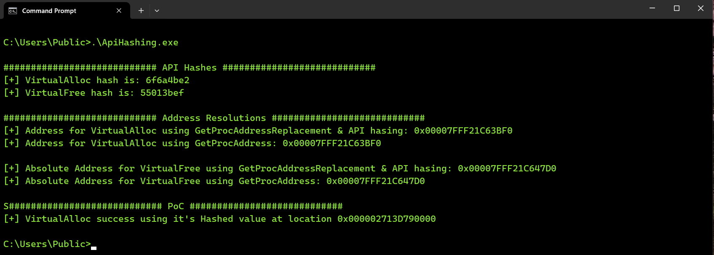
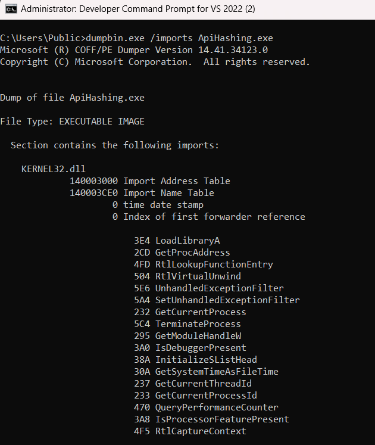

# API-Hashing
PoC demonstrating the hashing of Win32 API's to dynamically resolve function addresses, circumventing Import Address Table (IAT) scrutiny.

# Features
Hashes Win32 API function names & uses a custom `GetProcAddress` replacement function to resolve the hashed Win32 API addresses\
Includes a sample demonstration of using `VirtualAlloc` and `VirtualFree` to allocate & free memory

# Usage
Clone the repository & build the project. I use Visual Studio 2022

# Output
In this example, the executable successfully hashes the VirtualAlloc and VirtualFree APIs, retrieves their addresses using a custom GetProcAddress function, and verifies that the addresses match.\
Finally, the executable allocates memory by utilizing the hashed VirtualAlloc address\

 

Using `dumpbin.exe`, we can see that neither `VirtualAlloc` nor `VirtualFree` were found in the Import Address Table\
\
